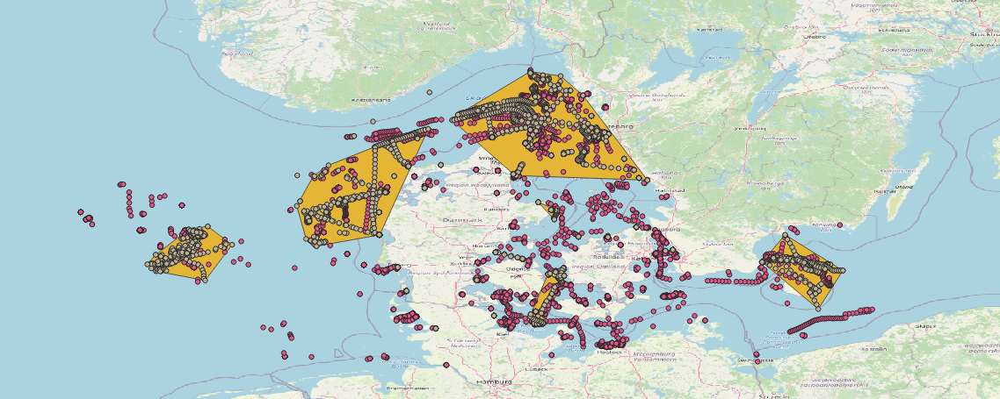

# AISDK

## Introduction

We will analyze a sample of AIS data from the Danish Maritime Authority.
You can jump straight to the jupyter notebook as we already preprocess the data.

The data as been preprocessed using postgres, postgis, and timescaledb. We performed the following:

- Remove position with incorrect coordinates
- Keep one position every thirty minutes using timescaledb
- Calculate a fishing score based on [Global Fish Watch heuristic model](https://github.com/GlobalFishingWatch/vessel-scoring/blob/master/notebooks/Model-Descriptions.ipynb)
- Calculate a distance from land using land polygon from [pgosmdata](https://github.com/gma2th/pgosmdata) and postgis nearest neighbor algorithm
- Create fishing zones with dbscan algorithm

Here's is an overview of the data in QGIS.

- The yellow points are vessels that report "Engaged in fishing" as their navigational status
- The red points are vessels that don't report "Engaged in fishing" as their navigational status but have a fishing score above 0.5 (out of 1)
- The yellow polygons are fishing zone we computed using postgis dbscan algorithm on positions of vessels that reported "Engaged in fishing" as their navigational status



## Analysis

Check out the jupyter notebook with:

```bash
conda env create -f environment.yml
jupyter notebook
```

## Preprocessing

### Requirements

This project has been tested with:

- Postgres 12.2
- Postgis 3.0.1
- Timescaledb 1.7.1

You will need at least postgresql-client and ogr2ogr installed on your local machine.
You will need a postgres database with the extension postgis and timescaledb. You can refer to [TimescaleDB Installation Guide](https://docs.timescale.com/latest/getting-started/installation/), you can install it on your local machine on using docker.

## Download data

Download ais data from the [Danish Marithim Authority](https://www.dma.dk/SikkerhedTilSoes/Sejladsinformation/AIS/Sider/default.aspx) and place it under the data/ directory.

### Run

```bash
createdb aisdk
source .env.example  # Edit if necessary
./prepare.sql
```

## Next steps

- We use Global Fish Watch heuristic model to predict if vessels are fishing. We could go further by using their logistic model. This would remove some false positives.
- Perform track analysis to find gaps or AIS spoofing in messages received.
